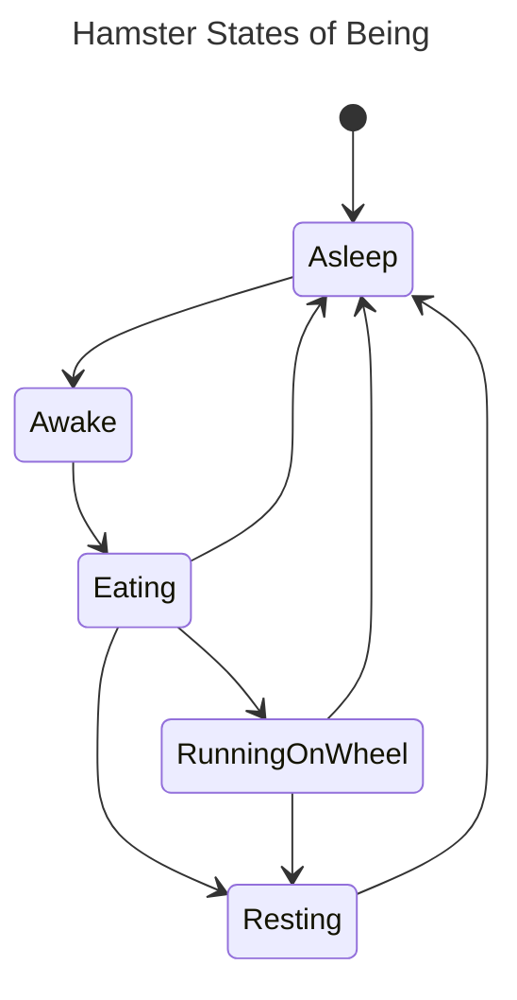

KFSM is Finite State Machinery for Kotlin.

[](https://central.sonatype.com/namespace/app.cash.kfsm)


## How to use

See [lib/src/test/kotlin/com/squareup/cash/kfsm/exemplar](https://github.com/cashapp/kfsm/tree/main/lib/src/test/kotlin/com/squareup/cash/kfsm/exemplar) 
for an example of how to use this library.

In a KFSM state machine, the states are defined as classes that extend `State` and declare the states that can be 
transitioned to. Transitions are defined as instances of `Transition` and encapsulate the effect of transitioning.

Take this state machine, for example:



### The states

Your state machine is defined as a set of sealed objects extending State. Each State must declare zero or more other
states that it can transition to.

```kotlin
/**
 * Base class for all the states a Hamster can embody.
 */
sealed class HamsterState(vararg to: HamsterState) : State(to.toSet())

/** Hamster is awake... and hungry! */
object Awake : HamsterState(Eating)

/** Hamster is eating ... what will they do next? */
object Eating : HamsterState(RunningOnWheel, Asleep, Resting)

/** Wheeeeeee! */
object RunningOnWheel : HamsterState(Asleep, Resting)

/** Sits in the corner, chilling */
object Resting : HamsterState(Asleep)

/** Zzzzzzzzz */
object Asleep : HamsterState(Awake)
```

#### Test your state machine

The utility `StateMachine.verify` will assert that a defined state machine is valid - i.e. that all states are visited
from a given starting state.

```kotlin
StateMachine.verify(Awake, HamsterState::class).isRight() shouldBe true
```

### The value

Your transitionable value must extend `Transitionable`. This simply means it has a property `state`.

```kotlin
data class Hamster(override val state: HamsterState) : Transitionable<HamsterState>
```


### The transitions

For a value to move from one state to another it must be transitioned. Declare each of the valid transitions separately,
starting with a base class.

```kotlin
abstract class HamsterTransition : Transition<Hamster, HamsterState, HamsterFailure> {

  constructor(from: HamsterState, to: HamsterState) : super(from, to)
  constructor(from: Set<HamsterState>, to: HamsterState) : super(from, to)

  override fun makeFailure(
    value: Hamster,
    effectCompleted: Boolean,
    updateCompleted: Boolean,
    cause: Throwable
  ): HamsterFailure = InternalHamsterError(cause)
}
```

Transitions must define the side-effects that take place as part of the transition.

```kotlin
class EatBreakfast(private val food: String) : HamsterTransition(from = Awake, to = Eating) {

  override suspend fun effect(value: Hamster): Either<HamsterFailure, Hamster> =
    when (food) {
      "broccoli" -> value.eat(food).right()
      "cheese" -> LactoseIntoleranceTroubles(food).left()
      else -> value.eat(food).right()
    }
}
```

Transitions must also define how to create a failure object, given some important context such as whether the effect has
completed successfully (there are steps after the effect which might fail).

```kotlin
  override fun makeFailure(
    value: Hamster,
    effectCompleted: Boolean,
    updateCompleted: Boolean,
    cause: Throwable
  ): HamsterFailure = InternalHamsterError(cause)
```

Any attempt to define a transition where the `from` state cannot directly reach the `to` state will be an invariant
failure and result in exceptions when wiring your application.


### The transitioner

The StateTransitioner is the machine that applies a transition to a value. In the constructor, you must define how to
update the value (e.g. write to DB) and how to notify of the successful transition (e.g. emit an event)

```kotlin
  val transitioner = StateTransitioner<Hamster, HamsterState, HamsterFailure>(
    update = { h, t -> h.copy(state = t.to) },
    notifyOnSuccess = { h, t -> println("updated: $h via $t") }
  )
```

Then you can transition.

```kotlin
transitioner.transition(hamster, EatBreakfast("broccoli"))
```

## Documentation

The API documentation is published with each release
at [https://cashapp.github.io/kfsm](https://cashapp.github.io/kfsm)


## Building

> ℹ️ kfsm uses [Hermit](https://cashapp.github.io/hermit/).
>
>>   Hermit ensures that your team, your contributors, and your CI have the same consistent tooling. Here are the [installation instructions](https://cashapp.github.io/hermit/usage/get-started/#installing-hermit).
>> 
>> [Activate Hermit](https://cashapp.github.io/hermit/usage/get-started/#activating-an-environment) either
by [enabling the shell hooks](https://cashapp.github.io/hermit/usage/shell/) (one-time only, recommended) or manually
sourcing the env with `. ./bin/activate-hermit`.

Use gradle to run all tests

```shell
gradle build
```

## Changelog

See a list of changes in each release in the [CHANGELOG](CHANGELOG.md).

## Contributing

For details on contributing, see the [CONTRIBUTING](CONTRIBUTING.md) guide.
