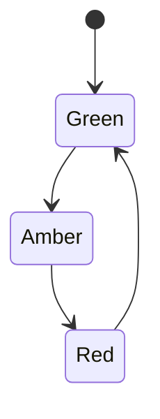

kFSM is Finite State Machinery for Kotlin.

[](https://central.sonatype.com/namespace/app.cash.kfsm)

## How to use

There are four key components to building your state machine.

1. The nodes representing different states in the machine - `State`
2. The type to be transitioned through the machine - `Value`
3. The effects that are defined by transitioning from one state to the next - `Transition`
4. A transitioner, which can be customised when you need to define pre and post transition hooks - `Transitioner`

Let's build a state machine for a traffic light.



### State

The states are a collection of related classes that define a distinct state that the value can be in. They also define
which states are valid next states.

```kotlin
sealed class Color(to: () -> Set<Color>) : app.cash.kfsm.State(to)
data object Green : Color({ setOf(Amber) })
data object Amber : Color({ setOf(Red) })
data object Red : Color({ setOf(Green) })
```

### Value

The value is responsible for knowing and updating its current state.

```kotlin
data class Light(override val state: Color) : Value<Light, Color> {
    override fun update(newState: Color): Light = this.copy(state = newState)
}
```

### Transition

Types that provide the required side-effects that define a transition in the machine.

```kotlin
abstract class ColorChange(
    from: NonEmptySet<Color>,
    to: Color
) : Transition<Light, Color>(from, to) {
    // Convenience constructor for when the from set has only one value
    constructor(from: Color, to: Color) : this(nonEmptySetOf(from), to)
}

class Go(private val camera: Camera) : ColorChange(from = Red, to = Green) {
    override suspend fun effect(value: Light) = camera.disable()
}

object Slow : ColorChange(from = Green, to = Amber)

class Stop(private val camera: Camera) : ColorChange(from = Amber, to = Red) {
    override suspend fun effect(value: Light) = camera.enable()
}
```

### Transitioner

Moving a value from one state to another is done by the transitioner. We provide it with a function that declares how to
persist values.

```kotlin
class LightTransitioner(
    private val database: Database
) : Transitioner<ColorChange, Light, Color>(
    persist = { it.also(database::update).right() }
)
```

Each time a transition is successful, the persist function will be called.

#### Pre and Post Transition Hooks

It is sometimes necessary to execute effects before and after a transition. These can be defined on the transitioner.

```kotlin
class LightTransitioner ...  {
    override suspend fun preHook(value: V, via: T): ErrorOr<Unit> = Either.catch {
        globalLock.lock(value)
    }

    override suspend fun postHook(from: S, value: V, via: T): ErrorOr<Unit> = Either.catch {
        globalLock.unlock(value)
        notificationService.send(via.successNotifications())
    }
}
```

### Transitioning

With the state machine and transitioner defined, we can progress any value through the machine by using the
transitioner.

```kotlin
val transitioner = LightTransitioner(database)
val greenLight: ErrorOr<Light> = transitioner.transition(redLight, Go)
```

### More examples

See [lib/src/test/kotlin/app/cash/kfsm/exemplar](https://github.com/cashapp/kfsm/tree/main/lib/src/test/kotlin/app/cash/kfsm/exemplar)
for a full example of how to use this library.

## Safety

How does kFSM help validate the correctness of your state machine and your values?

1. It is impossible to define a Transition that does not comply with the transitions defined in the States. For example,
   a transition that attempts to define an arrow between `Red` and `Amber` will fail at construction.
2. If a value has already transitioned to the target state, then a subsequent request will not execute the transition a
   second time. The result will be success. I.e. it is a no-op.
    1. (unless you have defined a circular/self-transition, in which case it will)
3. If a value is in a state unrelated to the executed transition, then the result will be an error and no effect will be
   executed.

### Testing your state machine

The utility `StateMachine.verify` will assert that a defined state machine is valid - i.e. that all states are visited
from a given starting state.

```kotlin
StateMachine.verify(Green) shouldBeRight true
```


### Document your state machine

The utility `StateMachine.mermaid` will generate a mermaid diagram of your state machine. This can be rendered in markdown.
The diagram of `Color` above was created using this utility.

```kotlin
StateMachine.mermaid(Green) shouldBeRight """stateDiagram-v2
    [*] --> Green
    Amber --> Red
    Green --> Amber
    Red --> Green
    """.trimMargin()
```

## Documentation

The API documentation is published with each release
at [https://cashapp.github.io/kfsm](https://cashapp.github.io/kfsm)

See a list of changes in each release in the [CHANGELOG](CHANGELOG.md).

## Contributing

For details on contributing, see the [CONTRIBUTING](CONTRIBUTING.md) guide.

### Building

> ℹ️ kFSM uses [Hermit](https://cashapp.github.io/hermit/).
>
>> Hermit ensures that your team, your contributors, and your CI have the same consistent tooling. Here are
> > the [installation instructions](https://cashapp.github.io/hermit/usage/get-started/#installing-hermit).
>>
>> [Activate Hermit](https://cashapp.github.io/hermit/usage/get-started/#activating-an-environment) either
> > by [enabling the shell hooks](https://cashapp.github.io/hermit/usage/shell/) (one-time only, recommended) or
> > manually
> > sourcing the env with `. ./bin/activate-hermit`.

Use gradle to run all tests

```shell
gradle build
```
